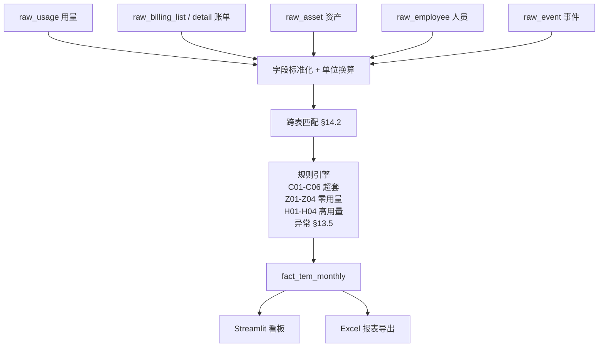

# 诚翼畅联 · TEM 一期账务底座 MVP

终端全生命周期管理平台一期建设内容 —— **账务底座 / TEM 通信费用管理模块** 的本地化 MVP 实现。

配套设计文档：《一期账务底座与 TEM 通信费用管理模块详细设计 v1.1》。

> 📂 **如何把真实 Excel 数据导入到系统？**
>
> - **网页拖拽**（最简单）：启动看板后选左侧第一项 **📤 数据导入**，拖入 Excel 即可自动识别字段类型并入库
> - **命令行批量**：把文件按目录约定放到 `data/raw/...`，跑 `tem run --客户 X --项目 Y --账期 Z`
>
> 详细字段映射、常见问题见 [docs/导入指南.md](docs/导入指南.md)。模板文件在 `data/samples/`。

## 核心能力

以 **客户ID + 项目ID + 账期 + 服务号码** 为主键，把运营商账单/用量、企业资产/人员、月度事件五类数据贯通成 `fact_tem_monthly` 月度结果表，并产出七张管理报表与一个 Streamlit 看板。

```
原始 Excel  →  五张 raw_* 表  →  字段标准化  →  跨表匹配  →  规则引擎  →  fact_tem_monthly  →  报表 + 看板
```

## 快速开始

```powershell
# 1. 安装依赖
pip install -e .

# 2. 初始化 DuckDB 与表结构
tem init-db

# 3. 投递原始数据到 data/raw/ 下
#    目录约定：data/raw/{type}/{客户ID}/{项目ID}/[{账期}/]*.xlsx|*.csv
#    type ∈ {usage, billing, asset, employee, event}
#
#    例：
#    data/raw/usage/johnson/work-phone/202604/usage.xlsx
#    data/raw/billing/johnson/work-phone/202604/billing_清单.xlsx
#    data/raw/billing/johnson/work-phone/202604/billing_明细.xlsx
#    data/raw/asset/johnson/work-phone/asset.xlsx
#    data/raw/employee/johnson/work-phone/employee.xlsx
#    data/raw/event/johnson/work-phone/events.xlsx

# 4. 一键跑通 ingest + build + export
tem run --客户 johnson --项目 work-phone --账期 202604

# 5. 启动看板
streamlit run "app/诚翼畅联数据管理平台.py"
```

CLI 子命令一览：

| 子命令 | 作用 |
|--------|------|
| `tem init-db` | 创建/重建 DuckDB 库 + 6 张表 + 视图 |
| `tem status` | 查看库中各表行数 |
| `tem ingest --客户 X --项目 Y --账期 YYYYMM` | 按目录扫描并导入原始数据；可加 `--type usage` 限定类型 |
| `tem build --客户 X --项目 Y --账期 YYYYMM` | 运行规则引擎，生成 `fact_tem_monthly` |
| `tem export --客户 X --项目 Y --账期 YYYYMM` | 导出 `data/output/*_TEM月报.xlsx` |
| `tem run --客户 X --项目 Y --账期 YYYYMM` | 上面三步一气呵成 |

## 目录结构

```
.
├── config/                  # 客户/项目/阈值配置（入库）
│   ├── settings.yaml        # 客户、项目、数据库路径
│   └── rules.yaml           # 规则阈值（超套5%、P95、低用量阈值等）
├── data/
│   ├── raw/                 # 原始 Excel 投递目录（不入库）
│   ├── samples/             # 占位空模板
│   └── output/              # 导出 Excel 报表（不入库）
├── db/tem.duckdb            # 主库（不入库）
├── sql/
│   ├── 001_raw_tables.sql        # 五张 raw_* 表 + 平台通用字段
│   ├── 002_fact_tem_monthly.sql  # 月度结果表
│   └── 003_views.sql             # 七张报表视图
├── src/tem/
│   ├── config.py                 # 配置加载
│   ├── db.py                     # DuckDB 连接与初始化
│   ├── ingest/                   # 五张 raw_* 表 ingest
│   ├── normalize/                # 字段标准化与单位换算
│   ├── match/join.py             # §14.2 跨表匹配
│   ├── rules/                    # 规则引擎（超套/零用量/高用量/异常）
│   ├── build/fact_tem_monthly.py # 月度结果表组装
│   ├── reports/exporter.py       # Excel 报表导出
│   └── cli.py                    # 命令行入口
├── app/                          # Streamlit 多页看板
│   ├── 诚翼畅联数据管理平台.py      # 首页（§15.1 月度首页）
│   └── pages/                    # 子页（§15.2 ~ §15.7 + 报表导出）
└── tests/                        # 单元测试
```

## 数据流（设计文档 §14.1）



## 字段映射表（部分）

来源 Excel 的列名口径不一，统一在 [src/tem/normalize/fields.py](src/tem/normalize/fields.py) 维护别名字典。下表给出几组典型映射，完整清单见代码。

| 统一字段 | 来源（usage） | 来源（billing） | 来源（asset） | 来源（event） |
|----------|--------------|---------------|--------------|--------------|
| 服务号码 | 设备号 / 服务号码 | 号码 / 服务号码 | Phone number | 原始号码（事件主） |
| 账期 | 月账期 / 账期 | 账期 / 账单月份 | — | 由 开始时间 派生 |
| 员工ID | — | — | 员工编号 / 内部用户编号 | 使用人WWID |
| 邮箱 | — | — | 邮箱 / Email | — |
| 总通话分钟 | 总通话时长_秒 / 60 (U02) | — | — | — |
| 总流量GB | 总流量_M / 1024 (U03) | — | — | — |
| 实际应收 | — | 实际应收（B01 主口径） | — | — |
| 标准套餐金额 | — | — | 标准套餐金额（C01 基准） | — |
| Cost Center | — | — | — | — |

新增来源列名时，只需修改 `SERVICE_NUMBER_ALIASES` 等字典即可，无需改动 ingest / rules / build 代码。

## 规则编号 ↔ 代码位置交叉引用

| 规则编号 | 含义 | 代码位置 |
|---------|------|---------|
| U01–U06 | 用量字段标准化 | [src/tem/normalize/fields.py](src/tem/normalize/fields.py)、[src/tem/ingest/usage.py](src/tem/ingest/usage.py) |
| B01–B07 | 账单字段标准化与拆解 | [src/tem/ingest/billing.py](src/tem/ingest/billing.py) |
| A01–A07 | 资产字段标准化 | [src/tem/ingest/asset.py](src/tem/ingest/asset.py) |
| E01–E06 | 人员字段标准化与离职判定 | [src/tem/ingest/employee.py](src/tem/ingest/employee.py)、[src/tem/rules/anomalies.py](src/tem/rules/anomalies.py) |
| EV01–EV16 | 事件总表、状态、改号、副卡、未闭环 | [src/tem/ingest/event.py](src/tem/ingest/event.py)、[src/tem/rules/event_rules.py](src/tem/rules/event_rules.py) |
| C01–C06 | 超套（金额、率、5% 预警） | [src/tem/rules/overpackage.py](src/tem/rules/overpackage.py) |
| Z01–Z04 | 零用量、零用量但计费、长期闲置 | [src/tem/rules/zero_usage.py](src/tem/rules/zero_usage.py) |
| H01–H04 | 高流量、高通话（hard cap + P95） | [src/tem/rules/high_usage.py](src/tem/rules/high_usage.py) |
| 漫游异常 | 用量或账单含国际/港澳台漫游 | [src/tem/rules/anomalies.py](src/tem/rules/anomalies.py) `apply_roaming` |
| 增值业务异常 | 一级科目含"增值业务费"且非白名单 | [src/tem/rules/anomalies.py](src/tem/rules/anomalies.py) `apply_value_added` |
| 离职后计费 | 离职日期早于账期月末且实际应收 > 0 | [src/tem/rules/anomalies.py](src/tem/rules/anomalies.py) `apply_post_termination` |
| 资产/人员缺失 | 跨表 join 后未匹配 | [src/tem/match/join.py](src/tem/match/join.py) |
| §14.2 五步匹配 | 账单⇔用量⇔资产⇔人员⇔事件 | [src/tem/match/join.py](src/tem/match/join.py) |
| §12.4 月度结果表 | 主键 客户ID+项目ID+账期+服务号码 | [src/tem/build/fact_tem_monthly.py](src/tem/build/fact_tem_monthly.py)、[sql/002_fact_tem_monthly.sql](sql/002_fact_tem_monthly.sql) |
| §15.1–§15.7 报表 | 月度首页 / 费用 / 用量 / 超套 / 异常 / 成本中心 / 事件 | [sql/003_views.sql](sql/003_views.sql)、[app/pages/](app/pages/) |

## 规则阈值

集中维护在 [config/rules.yaml](config/rules.yaml)：

| 参数 | 默认值 | 含义 |
|------|-------|------|
| `overpackage.warn_ratio` | 0.05 | C05：实际应收超过标准套餐金额 5% -> 超套预警 |
| `zero_usage.consecutive_months` | 3 | Z03：连续多月零用量但仍计费 -> 长期闲置 |
| `low_usage.voice_min_threshold` | 5 | 月通话 ≤ 5 分钟视为低用量 |
| `low_usage.data_gb_threshold` | 0.1 | 月流量 ≤ 0.1GB 视为低用量 |
| `high_usage.data_gb_hard_cap` | 50 | 月流量 > 50GB 直接判高流量 |
| `high_usage.voice_min_hard_cap` | 1500 | 月通话 > 1500 分钟直接判高通话 |
| `roaming.bill_keywords` | 国际漫游/港澳台漫游/国际长途 | 账单一级科目命中即判漫游 |
| `value_added_service.bill_keywords` | 增值业务费 | 一级科目命中且实际应收 > 0 -> 增值业务异常 |

## 多客户/多项目

每张表都强制带 [§6.1 平台通用字段](#) —— `客户ID, 客户名称, 项目ID, 项目名称, 数据月份, 数据来源, 导入批次号, 数据更新时间`，因此天然支持多客户/多项目隔离。

新增客户时编辑 [config/settings.yaml](config/settings.yaml) 的 `clients` 节即可。

## 测试

```powershell
pip install pytest pytest-cov
python -m pytest -q
```

测试覆盖：
- `tests/test_normalize.py` — 字段别名、单位换算、号码/账期标准化
- `tests/test_rules.py` — 超套 C01–C06、零用量 Z01–Z04、高用量 H01–H04、漫游、增值业务、离职后计费、异常聚合
- `tests/test_pipeline_e2e.py` — ingest → build → query 端到端跑通

## 与设计文档边界一致

不实现（设计文档 §4.2 / §16.4）：
- 自动邮件通知、审批流集成
- 运营商 API 自动接入
- ITSM / ServiceNow 深度集成
- AI 自动决策与生成
- Obsolete 历史追溯
- 日级费用拆分
- 多运营商统一 TEM 平台

第一阶段以**规则引擎 + 数据底座**为主，确保账单、用量、资产、人员、事件五类数据可匹配、可追溯、可分析；后续再扩展 AI 辅助匹配、异常解释、套餐优化建议。

## 风险与待补充项

1. **标准套餐金额来源（A06）**：资产表里"标准套餐金额"字段是否等于通信套餐基准价，需要拿到客户真实数据后核对。
2. **事件表子表字段差异（§11.4）**：维修/丢失子表当前未体现"完工时间"列，第一阶段以"总表"为准；后续推动子表字段统一后再扩展。
3. **真实 Excel 列名漂移**：不同月份/客户的运营商账单列名可能微调，需要在 [src/tem/normalize/fields.py](src/tem/normalize/fields.py) 的别名字典里增量维护，无需改动主代码。
